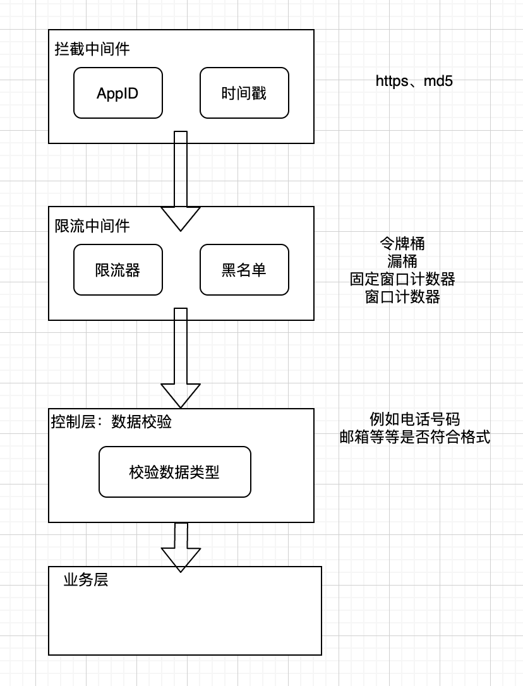

设计一个安全的对外接口



主要是在几个中间件上，拦截器、限流器, 另外数据类型校验器算在控制层中，校验完成后进入业务层

## https
需要将服务运行在https协议上作为基础步骤

## 拦截中间件

### APPID机制
APPID, 如果请求中没有携带合法的APPID则不予相应

``` plain
appid             是每个用户唯一的
app_secret        可以开发着平台更改
access_token      通过 appid +  app_secret  生成 ，（有效期2小时）
```

### 时间戳机制
时间戳机制，检验时间戳是否在5分钟之类

## 限流中间件
