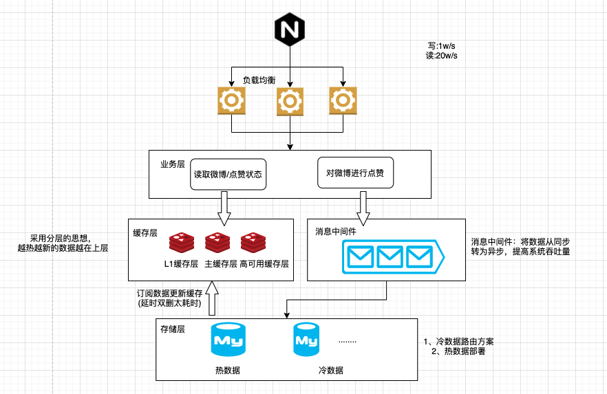

## 简介

类似于微博的点赞服务，满足性能和持续扩展的需要

- 性能要求：点赞请求1w/s, 访问请求20w/s
- 点赞功能: 某条微博点赞，每条微博只能被每人赞一次。
- 查询功能: 支持查询某人是否赞过某条微博

## 设计思想

对于在线服务，设计时需要考虑压力分流，同时兼顾分流的可扩展性。对于存储服务，需要考虑库表容量和新老数据拆分。

`核心组件`

- 网关节点: 负载均衡
- 缓存节点: 用来支持大量并发的读请求，采用类似L3层缓存
- 消息中心: 将同步写转为异步写，提高系统吞吐(通过事务消息的回查机制保障用户的操作行为不会丢失)
- 存储服务: 冷热数据分离、路由处理方案(高效的查询)

### 限流、防击穿

防击穿：查询用户对某微博的点赞信息时，先查缓存，如果缓存查询无结果，则需要经过布隆过滤器的校验，防止不存在的key查询数据库造成击穿。

限流：集群限流 + 单机限流(请求数 /cpu /load )

## 计算选型

- web服务: gin
- 存储服务: mysql
- 缓存服务: redis
- 消息中间件: rabbitmq
- 网关: nginx