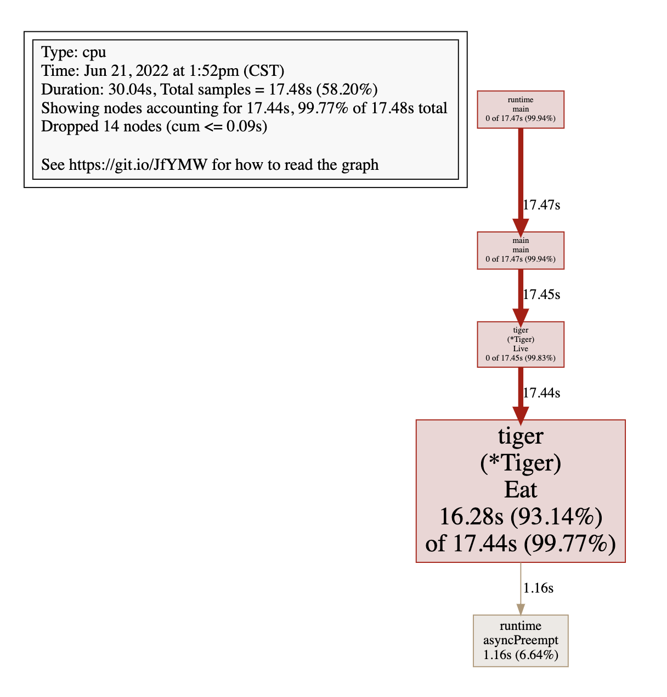
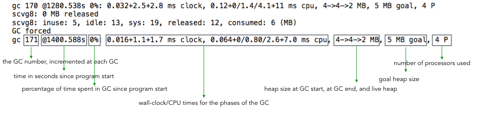

# 排查CPU占用过高

top命令确认

go tool pprof http://localhost:6060/debug/pprof/profile

进入交互使用top查看CPU占用较高的调用

top

使用list 名字 查看调用的具体位置

list Eat

如果安装了graphviz工具，使用web命令之后能够在web界面上看到调用链路图

brew install graphviz



修复问题代码继续后面的操作

# 排查内存占用过高

修复代码中的死循环，再次使用top会发现CPU占用率下来了

go tool pprof http://localhost:6060/debug/pprof/heap

再次使用top、list定位到问题代码

```bash
Total: 1.50GB
ROUTINE ======================== github.com/wolfogre/go-pprof-practice/animal/muridae/mouse.(*Mouse).Steal in /Users/dengronghui/Documents/Apps/public/handbook/Golang/go-pprof-practice-master/animal/muridae/mouse/mouse.go
    1.50GB     1.50GB (flat, cum) 99.90% of Total
         .          .     45:
         .          .     46:func (m *Mouse) Steal() {
         .          .     47:	log.Println(m.Name(), "steal")
         .          .     48:	max := constant.Gi
         .          .     49:	for len(m.buffer)*constant.Mi < max {
    1.50GB     1.50GB     50:		m.buffer = append(m.buffer, [constant.Mi]byte{})
         .          .     51:	}
         .          .     52:}
```

同样可以使用web可视化展示

## 排查频繁内存回收

获取程序运行时的GC日志

```bash
gc 1 @0.003s 7%: 0.022+2.1+0.002 ms clock, 0.18+1.1/1.9/3.0+0.019 ms cpu, 4->4->3 MB, 5 MB goal, 8 P
gc 2 @0.018s 3%: 0.009+1.8+0.001 ms clock, 0.073+0.096/2.2/0.16+0.013 ms cpu, 7->7->6 MB, 8 MB goal, 8 P
gc 3 @0.089s 0%: 0.022+0.92+0.013 ms clock, 0.17+0.095/1.0/0.75+0.10 ms cpu, 16->16->14 MB, 17 MB goal, 8 P
gc 4 @0.489s 0%: 0.023+1.5+0.014 ms clock, 0.18+0/2.4/1.1+0.11 ms cpu, 29->29->15 MB, 30 MB goal, 8 P
gc 1 @0.003s 1%: 0.013+0.55+0.002 ms clock, 0.013+0.22/0.17/0+0.002 ms cpu, 16->16->0 MB, 17 MB goal, 1 P
gc 2 @3.020s 0%: 0.070+0.56+0.002 ms clock, 0.070+0.17/0.20/0+0.002 ms cpu, 16->16->0 MB, 17 MB goal, 1 P
gc 3 @6.027s 0%: 0.15+0.98+0.003 ms clock, 0.15+0.36/0.36/0+0.003 ms cpu, 16->16->0 MB, 17 MB goal, 1 P
gc 4 @9.034s 0%: 0.10+0.63+0.002 ms clock, 0.10+0.16/0.23/0+0.002 ms cpu, 16->16->0 MB, 17 MB goal, 1 P
gc 5 @12.040s 0%: 0.070+0.53+0.002 ms clock, 0.070+0.23/0.19/0+0.002 ms cpu, 16->16->0 MB, 17 MB goal, 1 P
gc 6 @15.047s 0%: 0.11+0.66+0.002 ms clock, 0.11+0.23/0.27/0+0.002 ms cpu, 16->16->0 MB, 17 MB goal, 1 P
```



每次gc都从16MB释放到0MB，说明程序在不断的声明然后释放内存

接下来使用 pprof 排查时，我们在乎的不是什么地方在占用大量内存，而是什么地方在不停地申请内

`go tool pprof http://localhost:6060/debug/pprof/allocs`

## 排查协程泄漏

`go tool pprof http://localhost:6060/debug/pprof/goroutine`

同样使用top、list、web即可定位到

## 排查锁的争用

`go tool pprof http://localhost:6060/debug/pprof/mutex`